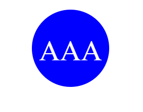
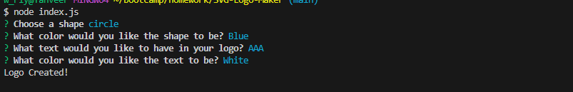
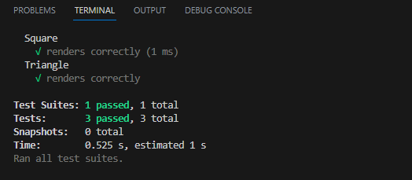

# Object-oriented Programming: SVG Logo Maker

## Overview

This application gives freelance developers a way to create simple logos for their projects.  It utilizes inquirer to prompt the user input like color, shape and text for logo and generates SVG logo to a `.svg` file.

## Table of Contents:
- [Overview](#Overview)
- [Usage Information](#Usage-Information)
- [Installation Process](#Installation-Process)
- [Screenshots](#Screenshots)
- [Live Screen Recording](### Live Screen Recording)
- [Test-Instructions](#Test Instructions)
- [License](#License)

>
### Usuage Information

To begin, use the command line to navigate to the directory of the application, install all dependencies (npm i), then type the command node index.js. The user will be prompted to answer a series of questions. Once all questions have been answered properly, a message will display to the command line telling you your logo has been generated. Find your new logo in the newly generated SVG file.

## Installation Process

Use the terminal to run the command npm i to install the dependencies associated with this application (i.e .. inquirer and jest directly from the command line).  Then to run the application, within the terminal, type the command node index.js.

## Screenshots

The examples of logo created.  

## Live Screen Recording of Application Functionality

https://drive.google.com/file/d/1ITH68juKl_B_JoeoIkmw79xXIld1Y8LI/view

## Test-Instructions

To run unit testing, open the terminal, and use the command npm run test.

As of now there is one test suite with three tests. The test suite is checking for a render() method to return a string for the corresponding SVG file with the given shape color.

## License

NOTICE: This application is covered under the MIT License

 [Open Source Initiative Link](https://opensource.org/licenses/MIT)
---
© 2023 edX Boot Camps LLC. Confidential and Proprietary. All Rights Reserved.
